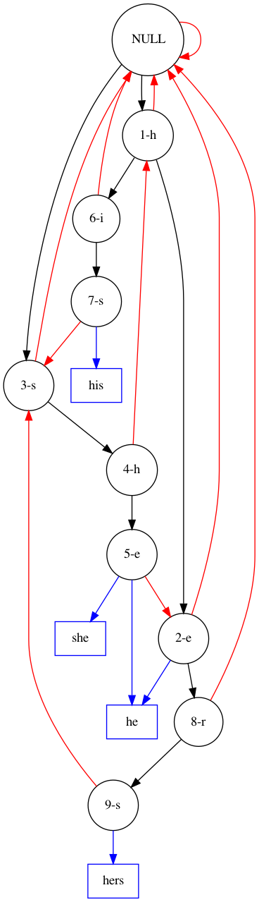

# Aho & Corasick - C++ implementation

[](https://github.com/be-next/Aho_Coratchick/blob/main/LICENSE)
[](https://app.codacy.com/gh/be-next/Aho-Corasick?utm_source=github.com&utm_medium=referral&utm_content=be-next/Aho-Corasick&utm_campaign=Badge_Grade_Settings)
[](https://img.shields.io/badge/c%2B%2B-%3E%3D%20c%2B%2B17-blue)


## Introduction

This code is a C++ implementation of Aho-Corasick patern matching algorithm.

In their paper published in 1975, Alfred V. Aho and Margaret J. Corasick describe this algorithm like this:

> [Aho-Corasick is an] efficient algorithm to locate all occurences of any of finite number of keywords in a string of text.

Nowaday, this algorithm remains the best one in termes of memory usage and complexity to search lot of patterns simultaneously in one pass. The complexity is linear in the length of the patterns plus the length of the searched text plus the number of output matches.

The famous example is [GNU Grep](https://www.gnu.org/software/grep/manual/html_node/index.html) (cf. [5 Performance](https://www.gnu.org/software/grep/manual/html_node/Performance.html#Performance) page) that uses Aho-Corasick algorithm to match multiple fixed patterns. 

## Why another Aho & Corasick implementation?

Reading this page means you had made some few searches about Aho & Corasick algorithm, and you would certainly agree with that there are a lot of Aho & Corasick algorithm implementations in many languages.

The main aim of this code is to propose a light, simple and easy to read Aho & Corasick algorithm implementation using a lexicographic tree.

Using a lexicographic tree is a such of naïve approch, but that allows to:

- remain close to what we figure out when we are thinking about this algorithm,
- take avantage of the tree structure to implement some algorithm's parts in recursive way (e.g. failure nodes computation or goto/output fonction)

In addition, with this code you will find:

- An easy to use, adapt and embed object-oriented implementation.
- An uncommon recursive implementation of calculating failure nodes (definitely needs improvement).
- A function to convert tree to a DataViz graph file. This file can be converted in picture, that should be helpful to understand how the aho-coracick algorithm works.

## Usage

This implementation is header only. To compile the code, your compiler must support C++17 standard features.

The following will create a lexicographic tree with a couple of keywords.

```cpp
 aho_corasick::LexicographicTree lt;
 
 lt.addKeyword( "he" );
 lt.addKeyword( "she" );
 lt.addKeyword( "his" );
 lt.addKeyword( "hers" );

 lt.finalize();
```

Once the tree structure is *finalized*, it is ready to be used to find the keywords: just give the characters one by one to the `processAndGetOutput` methode like this:

```cpp
std::string text("ushers");

for(const auto& current_char : text) {
  for( const auto* str : lt.processAndGetOutput(current_char)) {
      std::cout << *str << std::endl;
  }
```

Each call to `processAndGetOutput` methode returns a "set" of keywords. This set may or may not be empty, depending on whether the last `current_char` reached none, one or more keywords.

### How to visualize lexicographic tree

The methode

```cpp
const std::string DisplayTools::getGraphVizDescription( const LexicoNode * lnode, bool graphSuffix = true, bool graphWord = true  )
```

can be used to transform the tree in to DataViz file that would be used later to draw the tree.

Then use DataViz `dot` command like this:

```sh
> dot -Tpng graph1.dot > graph1.png
```

The result is:



To view [GraphViz](http://www.graphviz.org/) diagrams online, visit this project and try to [use GraphvizOnline online here](http://dreampuf.github.io/GraphvizOnline/).

## Further reading

- [Aho-Corasick white paper](http://cr.yp.to/bib/1975/aho.pdf), from Bell technologies
- [M. Crochemore and W. Rytter, Text Algorithms, Oxford University Press, New York, 1994, 412 pages. ISBN 0-19-508609-0](http://www-igm.univ-mlv.fr/~mac/REC/B1.html). ([Full text In pdf format, 396 pp](http://www-igm.univ-mlv.fr/~mac/REC/text-algorithms.pdf)).
